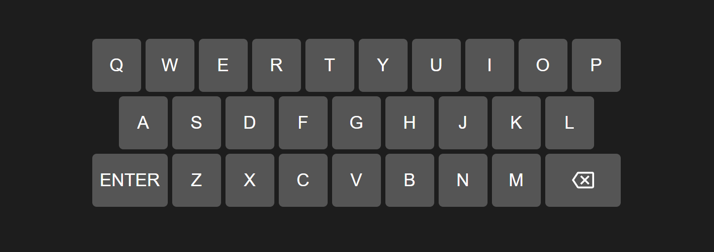

# css-exercice
Ejercicio de CSS

El objetivo es crear un efecto de teclado en pantalla con html y css. No tiene que ser funcional.

## Utilizar
1. **flex** para el body
2. **grid** para el teclado
3. **var()** para los colores y tamaños
4. **selector** de Atributo para las teclas
5. **clamp()** para el teclado sea responsive
